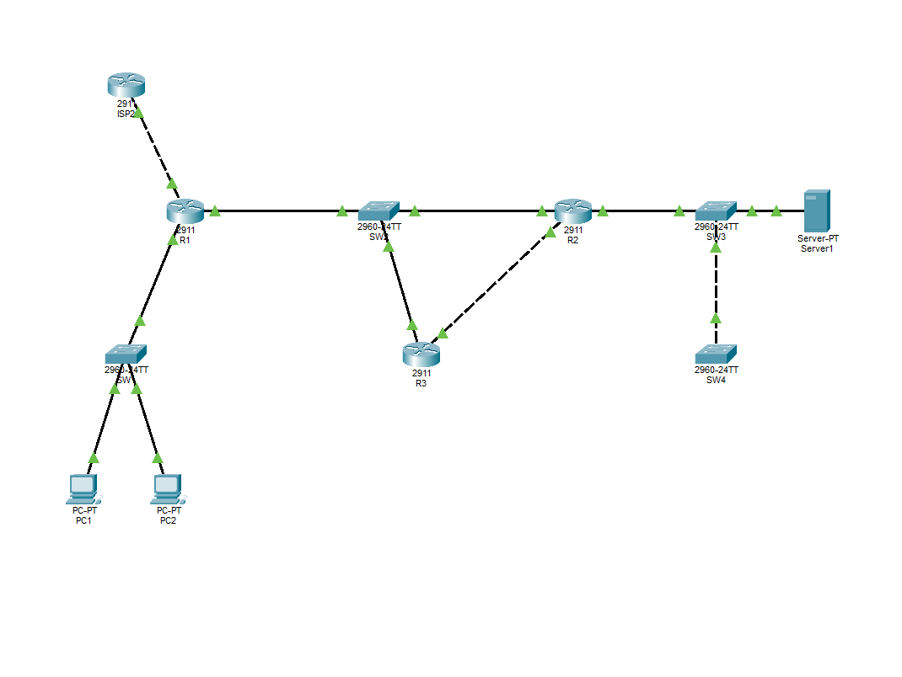

# Coppervale Network Outage Diagnostics

A Cisco Packet Tracer network troubleshooting and outage investigation project based on the Coppervale Semiconductor Fab case study.

This project recreates, diagnoses, fixes, and verifies five different network faults across Layer 2 switching, OSPF, EIGRP, BGP, and ICMP traffic. It includes the Packet Tracer topology, diagnostic command outputs, screenshots, and supporting case-study/lab-guide documents.

## Project Overview

Coppervale Semiconductor operates a multi-site network connecting:

- Head Office (HQ)
- Fab Plant
- Test & Packaging site
- Secondary ISP

The network uses multiple routing and switching technologies:

- STP for Layer 2 loop prevention
- OSPF for the WAN backbone
- EIGRP for the Fab-to-Test & Packaging connection
- BGP for the Internet edge
- ICMP for connectivity testing and traffic analysis

The objective of this project is to investigate five outage symptoms using a repeatable troubleshooting workflow:

```text
Reproduce
   ↓
Observe / Diagnose
   ↓
Identify Root Cause
   ↓
Apply Fix
   ↓
Verify Recovery
```

## Network Topology

The main topology contains:

```text
                         ISP2
                      AS 65002
                    172.16.2.2
                         |
                         |
                        R1
                   HQ Router
                   OSPF + BGP
                  /         \
                 /           \
             SW1              SW2
          HQ LAN          WAN Segment
          /   \          /     |     \
       PC1    PC2       R1     R2     R3
                         |      |      |
                         |      |      |
                        HQ     FAB    Test/Pkg
                               |        |
                              SW3      Loopback
                               |
                              SW4
```

### Main Devices

| Device | Type | Role |
|---|---|---|
| R1 | Cisco 2911 | HQ router, OSPF hub, BGP Internet edge |
| R2 | Cisco 2911 | Fab router, OSPF + EIGRP redistribution |
| R3 | Cisco 2911 | Test & Packaging router, EIGRP stub |
| ISP2 | Cisco 2911 | Secondary ISP and BGP route advertiser |
| SW1 | Cisco 2960 | HQ LAN switch |
| SW2 | Cisco 2960 | Multipoint WAN segment |
| SW3 | Cisco 2960 | Fab access switch and intended STP root |
| SW4 | Cisco 2960 | Neighbor switch used for STP fault reproduction |
| PC1 | PC | Normal HQ client |
| PC2 | PC | Attacker / ICMP flood source |
| Server1 | Server | Fab server and ICMP flood target |

## IP Addressing

### Router Interfaces

| Device | Interface | IP Address | Purpose |
|---|---|---|---|
| R1 | Gi0/0 | 192.168.10.1/24 | HQ LAN |
| R1 | Gi0/1 | 10.0.0.1/24 | WAN |
| R1 | Gi0/2 | 172.16.2.1/30 | ISP2 |
| R2 | Gi0/0 | 10.0.0.2/24 | WAN |
| R2 | Gi0/1 | 192.168.20.1/24 | Fab LAN |
| R2 | Gi0/2 | 10.2.0.1/30 | EIGRP link to R3 |
| R3 | Gi0/0 | 10.0.0.3/24 | WAN |
| R3 | Gi0/1 | 10.2.0.2/30 | EIGRP link to R2 |
| R3 | Loopback0 | 192.168.30.1/24 | Test & Packaging LAN |
| ISP2 | Gi0/0 | 172.16.2.2/30 | Link to R1 |

### End Hosts

| Device | IP Address | Default Gateway |
|---|---|---|
| PC1 | 192.168.10.10/24 | 192.168.10.1 |
| PC2 | 192.168.10.66/24 | 192.168.10.1 |
| Server1 | 192.168.20.100/24 | 192.168.20.1 |

### ISP2 Test Networks

ISP2 advertises five test networks through loopback interfaces:

```text
198.51.100.0/24
198.51.101.0/24
198.51.102.0/24
198.51.103.0/24
198.51.104.0/24
```

## Protocols Used

### STP

Spanning Tree Protocol prevents Layer 2 switching loops by selecting a root bridge and blocking redundant paths.

This project specifically demonstrates Root Guard and the `root-inconsistent` state.

### OSPF

OSPF provides the WAN backbone between R1, R2, and R3.

The WAN segment is configured as a non-broadcast multi-access network, requiring manually configured neighbors.

### EIGRP

EIGRP connects the Fab Plant to the Test & Packaging router.

R2 redistributes routes between OSPF and EIGRP, while R3 operates as an EIGRP stub.

### BGP

eBGP connects the HQ router to ISP2 using different autonomous systems.

A maximum-prefix limit protects R1 from receiving an unexpectedly large number of routes.

### ICMP

ICMP echo traffic is used for connectivity testing and for reproducing the simulated ping-flood condition.

---

# Five Network Faults Investigated

## A — STP Root Guard Fault

### Symptom

The Fab access switch reports a blocked port with a `root-inconsistent` condition.

### Root Cause

SW4 is configured with a lower STP priority than the intended root switch. It sends a superior BPDU toward SW3.

SW3 has Root Guard enabled on the connection to SW4, so the port is placed into the root-inconsistent state.

### Reproduce

```cisco
SW4(config)# spanning-tree vlan 1 priority 0
```

### Diagnose

```cisco
SW3# show spanning-tree inconsistentports
SW3# show spanning-tree interface fa0/3 detail
SW4# show spanning-tree vlan 1
```

Expected evidence includes:

```text
Root Inconsistent
```

and a Root Guard blocking message.

### Fix

```cisco
SW4(config)# spanning-tree vlan 1 priority 32768
```

### Verify

```cisco
SW3# show spanning-tree inconsistentports
```

Expected result:

```text
Number of inconsistent ports (segment) in the system : 0
```

The Root Guard protection remains enabled.

---

## B — OSPF Neighbor Stuck in ATTEMPT

### Symptom

One OSPF neighbor remains in `ATTEMPT` while another neighbor reaches `FULL`.

### Root Cause

The OSPF network type on R2 does not match the non-broadcast configuration used by the WAN hub.

On an NBMA network, OSPF cannot rely on multicast neighbor discovery and requires correctly configured neighbor relationships.

### Reproduce

```cisco
R2(config)# interface gi0/0
R2(config-if)# no ip ospf network non-broadcast
R2(config-if)# no ip ospf priority 0
```

### Diagnose

```cisco
R1# show ip ospf neighbor
R1# show ip ospf interface gi0/1
R2# show ip ospf interface gi0/0
R1# show running-config | section router ospf
```

The mismatch can be observed as:

```text
R1: Network Type NON_BROADCAST
R2: Network Type BROADCAST
```

### Fix

```cisco
R2(config)# interface gi0/0
R2(config-if)# ip ospf network non-broadcast
R2(config-if)# ip ospf priority 0

R1(config-router)# neighbor 10.0.0.2
```

### Verify

```cisco
R1# show ip ospf neighbor
```

Both R2 and R3 should reach:

```text
FULL
```

---

## C — EIGRP Stub Route Advertisement Fault

### Symptom

The Test & Packaging network exists locally on R3 but is missing from the routing table of R2.

### Root Cause

R3 is configured as an EIGRP `receive-only` stub.

A receive-only EIGRP stub listens for routes but does not advertise its own routes to neighbors.

### Reproduce

```cisco
R3(config)# router eigrp 100
R3(config-router)# eigrp stub receive-only
```

### Diagnose

```cisco
R3# show ip route 192.168.30.0
R2# show ip route eigrp
R3# show ip protocols
R1# ping 192.168.30.1
```

R3 should still show:

```text
C 192.168.30.0/24 is directly connected
```

but R2 should not learn the route through EIGRP.

### Fix

```cisco
R3(config)# router eigrp 100
R3(config-router)# eigrp stub connected summary
```

### Verify

```cisco
R2# show ip route eigrp
R1# ping 192.168.30.1
```

Expected route:

```text
D 192.168.30.0/24
```

and successful connectivity to the Test & Packaging network.

---

## D — BGP Maximum-Prefix Fault

### Symptom

The eBGP session to the secondary ISP repeatedly resets.

### Root Cause

R1 is configured with a maximum-prefix limit of 3, while ISP2 advertises 5 prefixes.

When the received prefix count exceeds the configured maximum, BGP tears down the session.

### Reproduce

```cisco
R1(config)# router bgp 65100
R1(config-router)# neighbor 172.16.2.2 maximum-prefix 3
```

### Diagnose

```cisco
R1# show ip bgp summary
R1# show ip bgp neighbors 172.16.2.2
ISP2# show ip bgp neighbors 172.16.2.1 advertised-routes
```

The router should report a maximum-prefix condition similar to:

```text
MAXPFX
Peer over limit
```

### Fix

After confirming that the advertised routes are legitimate:

```cisco
R1(config-router)# neighbor 172.16.2.2 maximum-prefix 10 80
```

Then reset the BGP session:

```cisco
R1# clear ip bgp 172.16.2.2
```

### Verify

```cisco
R1# show ip bgp summary
R1# show ip route bgp
```

The BGP session should become established and R1 should receive the five ISP2 test prefixes.

---

## E — ICMP Flood / Fragmentation Diagnostic

### Symptom

A Fab server receives a rapid burst of large fragmented ICMP echo requests.

### Source

```text
192.168.10.66
```

### Target

```text
192.168.20.100
```

### Reproduce

From PC2:

```text
PC2> ping -l 10000 -n 200 192.168.20.100
```

If Packet Tracer does not accept the payload size, use a smaller value.

### Packet Analysis

Packet Tracer Simulation Mode can be used to inspect the ICMP traffic.

For real Wireshark analysis, a useful display filter is:

```text
icmp.type == 8 && ip.flags.mf == 1
```

The expected pattern is:

- Multiple ICMP Echo Requests
- Same source and destination
- Large payloads
- IPv4 fragmentation
- More Fragments flag
- High packet rate

### Mitigation

An ACL can block the specific attacker while allowing normal ICMP replies and other traffic:

```cisco
R2(config)# ip access-list extended PROTECT-FAB
R2(config-ext-nacl)# deny icmp host 192.168.10.66 host 192.168.20.100 echo
R2(config-ext-nacl)# permit icmp any any echo-reply
R2(config-ext-nacl)# permit ip any any

R2(config)# interface gi0/0
R2(config-if)# ip access-group PROTECT-FAB in
```

### Verify

```cisco
R2# show access-lists
```

PC2 should no longer be able to flood Server1, while PC1 should retain normal connectivity.

---

# Root-Cause Summary

| Fault | Technology | Root Cause | Main Evidence | Fix |
|---|---|---|---|---|
| A | STP | SW4 priority lowered to 0 | Root Guard / Root Inconsistent | Restore priority to 32768 |
| B | OSPF | NBMA network-type mismatch / neighbor configuration issue | OSPF neighbor stuck in ATTEMPT | Restore non-broadcast configuration |
| C | EIGRP | R3 configured as receive-only stub | Route exists locally but is not advertised | Use `connected summary` |
| D | BGP | Maximum-prefix set below received prefix count | MAXPFX / Peer over limit | Raise limit with warning threshold |
| E | ICMP | Large fragmented ICMP burst from PC2 | Fragmented Echo Requests | Apply ACL and consider rate limiting |

# Are the Five Faults Related?

The five symptoms are not explained by a single network failure.

They occur at different layers and involve different technologies:

```text
A → Layer 2 / STP
B → Layer 3 / OSPF
C → Layer 3 / EIGRP
D → Internet edge / BGP
E → Host traffic / ICMP
```

A and C both affect the Fab/Test & Packaging area and could potentially be associated with the same maintenance window, but they remain separate configuration problems.

B, D, and E have independent causes and locations.

The investigation therefore treats each symptom separately and verifies each fix independently.

# Troubleshooting Methodology

The project follows a structured network troubleshooting process.

### 1. Establish a Healthy Baseline

Confirm that:

```cisco
R1# show ip ospf neighbor
R1# show ip route
R1# show ip bgp summary
SW3# show spanning-tree inconsistentports
```

Expected baseline:

- OSPF neighbors are `FULL`
- Required routes exist
- BGP session is established
- No STP inconsistent ports
- PC1 can reach Server1
- PC1 can reach the Test & Packaging network

### 2. Reproduce the Fault

A controlled configuration change is introduced to reproduce the reported symptom.

### 3. Capture BEFORE Evidence

Diagnostic commands are executed before changing the configuration.

### 4. Identify the Root Cause

The observed state is compared with the expected healthy state.

### 5. Apply the Correct Fix

Only the configuration responsible for the fault is changed.

### 6. Verify AFTER Recovery

The same diagnostic commands are used again to prove that the issue has been resolved.

# Repository Structure

```text
coppervale-network-outage-diagnostics/
│
├── documents/
│   ├── Case-study.pdf
│   └── Lab-guide-Setps.pdf
│
├── outputs/
│   ├── 02_ip_interface_brief_ISP2.txt
│   ├── 02_ip_interface_brief_R1.txt
│   ├── 02_ip_interface_brief_R2.txt
│   └── 02_ip_interface_brief_R3.txt
│
├── project/
│   └── coppervale_phase1.pkt
│
├── screenshots/
│   └── 01_topology_overview.png
│
└── README.md
```

# Project Files

## Packet Tracer Project

The main network simulation is available at:

```text
project/coppervale_phase1.pkt
```

Open this file using Cisco Packet Tracer to inspect and interact with the network topology.

## Diagnostic Outputs

The `outputs/` directory contains captured router interface information:

```text
02_ip_interface_brief_ISP2.txt
02_ip_interface_brief_R1.txt
02_ip_interface_brief_R2.txt
02_ip_interface_brief_R3.txt
```

These outputs provide a quick view of the configured interfaces and their operational states.

## Supporting Documents

The `documents/` directory contains:

- Case study documentation
- Packet Tracer laboratory guide

These documents provide the original scenario, topology requirements, troubleshooting workflow, fault reproduction steps, and expected verification results.

## Screenshots

The `screenshots/` directory contains visual documentation of the network topology and project state.

### Topology Overview



# Requirements

To open and run the network simulation:

- Cisco Packet Tracer
- Basic knowledge of Cisco IOS CLI
- Understanding of IPv4 addressing
- Basic knowledge of STP, OSPF, EIGRP, and BGP

Wireshark is optional for the ICMP packet-analysis portion. Packet Tracer Simulation Mode can be used when Wireshark is not available.

# How to Run

## 1. Clone the Repository

```bash
git clone https://github.com/Yashhh710/coppervale-network-outage-diagnostics.git
cd coppervale-network-outage-diagnostics
```

## 2. Open the Packet Tracer Project

Open:

```text
project/coppervale_phase1.pkt
```

using Cisco Packet Tracer.

## 3. Inspect the Baseline

Check the router and switch configurations before reproducing any faults.

Useful commands include:

```cisco
show ip interface brief
show ip route
show ip protocols
show ip ospf neighbor
show ip ospf interface
show ip bgp summary
show ip bgp
show spanning-tree
show spanning-tree inconsistentports
show access-lists
```

## 4. Reproduce the Faults

Use the fault-specific commands documented in this README and the laboratory guide.

For each fault:

```text
Break → Diagnose → Fix → Verify
```

## 5. Validate Connectivity

Example tests:

```text
PC1> ping 192.168.20.100
PC1> ping 192.168.30.1
```

# Key Cisco Commands Used

### Interface Diagnostics

```cisco
show ip interface brief
```

### Routing Table

```cisco
show ip route
```

### OSPF

```cisco
show ip ospf neighbor
show ip ospf interface
show running-config | section router ospf
```

### EIGRP

```cisco
show ip route eigrp
show ip protocols
```

### BGP

```cisco
show ip bgp summary
show ip bgp
show ip route bgp
show ip bgp neighbors
```

### STP

```cisco
show spanning-tree
show spanning-tree inconsistentports
show spanning-tree interface fa0/3 detail
```

### ACL

```cisco
show access-lists
```

# Learning Objectives

This project demonstrates practical troubleshooting skills in:

- Cisco IOS command-line diagnostics
- IPv4 addressing and interface verification
- STP Root Guard
- Superior BPDU detection
- OSPF neighbor states
- OSPF NBMA networks
- Manual OSPF neighbor configuration
- EIGRP stub behavior
- OSPF and EIGRP route redistribution
- eBGP peering
- BGP maximum-prefix protection
- ICMP traffic analysis
- IPv4 fragmentation
- ACL-based traffic filtering
- Root-cause analysis
- Network incident documentation
- Fault reproduction and verification

# Troubleshooting Evidence

A key part of this project is distinguishing symptoms from causes.

For example:

```text
Symptom:
OSPF neighbor is stuck in ATTEMPT

        ↓

Evidence:
R1 uses NON_BROADCAST
R2 uses BROADCAST

        ↓

Root Cause:
OSPF network-type mismatch

        ↓

Fix:
Configure R2 as NON_BROADCAST

        ↓

Verification:
Neighbor reaches FULL
```

The same evidence-based process is applied to all five faults.

# Security and Reliability Concepts Demonstrated

## Root Guard

Protects the intended STP root from unexpected superior BPDUs.

## BGP Maximum-Prefix

Limits the number of routes accepted from a BGP neighbor and helps protect router resources from unexpected route advertisements.

## EIGRP Stub

Reduces unnecessary routing queries and controls what a branch/stub router advertises.

## ACL Protection

Can block known malicious traffic patterns at a network boundary.

## ICMP Rate Limiting

In production environments, ICMP rate limiting can reduce the impact of excessive ICMP traffic.

# Recommended Remediation

The case study recommends addressing the faults according to their operational impact.

### OSPF WAN

Restore the WAN OSPF adjacency first because the WAN backbone provides connectivity between network areas.

### EIGRP Stub

Restore advertisement of the Test & Packaging network so other routers can reach that site.

### STP Root Guard

Restore the intended switch priority while retaining Root Guard protection.

### ICMP Flood

Contain the suspicious source using an ACL and consider ICMP rate limiting in a production environment.

### BGP Prefix Protection

Keep maximum-prefix protection enabled and configure an appropriate limit with sufficient headroom and a warning threshold.

# Production Considerations

This repository is an educational Cisco Packet Tracer project.

The configurations demonstrate network concepts in a controlled lab environment and should not be copied directly into a production network without reviewing:

- Interface naming
- IOS version
- Hardware capabilities
- Routing policy
- Security requirements
- Addressing plans
- Change-control procedures
- Existing ACLs
- BGP policies
- OSPF design
- EIGRP design
- Monitoring and alerting

Some commands or behaviors may differ slightly between Cisco IOS versions and Packet Tracer versions.

# Limitations

- The project is simulated in Cisco Packet Tracer.
- ISP1 is optional in the case-study design and the included configuration focuses on ISP2.
- Packet Tracer does not provide the full feature set of real Cisco IOS.
- Wireshark is not integrated into Packet Tracer; Simulation Mode can be used for packet inspection.
- Some real-world QoS or ICMP rate-limiting configurations are included only as representative production concepts.

# Academic / Project Use

This project was created as a networking case-study and practical troubleshooting exercise.

It demonstrates how multiple independent network failures can be reproduced and investigated using Cisco Packet Tracer and Cisco IOS diagnostic commands.

# Author

**Yash Tambade**

GitHub:  
https://github.com/Yashhh710

Repository:  
https://github.com/Yashhh710/coppervale-network-outage-diagnostics

# License

This project is intended for educational and academic use.

If you reuse or modify the project, please retain attribution to the original repository.

---

## Quick Reference

```text
Project:
Coppervale Network Outage Diagnostics

Platform:
Cisco Packet Tracer

Main Technologies:
STP
OSPF
EIGRP
BGP
ICMP
ACL

Faults:
A - STP Root Guard
B - OSPF NBMA Neighbor
C - EIGRP Stub
D - BGP Maximum-Prefix
E - ICMP Flood

Core Workflow:
Reproduce → Diagnose → Fix → Verify

Main Simulation:
project/coppervale_phase1.pkt
```
